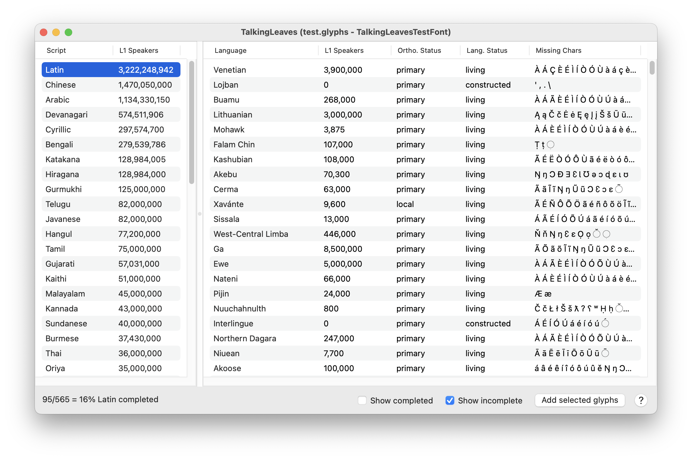
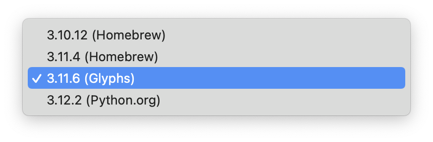

# TalkingLeaves

TalkingLeaves is a [GlyphsApp](https://glyphsapp.com/) plugin to explore the world's languages and writing systems. It also comes with useful features to show you what languages your font already supports, and which glyphs are needed to support more languages.

## What else can it do?

TalkingLeaves can help you understand the range of writing systems and character sets used around the world at a high level, or it can help you find some interesting facts and outliers. Talking Leaves can answer questions like:

* How many languages can a font support with only the 26 basic Latin letters? *(Answer: 103)*
* Which writing system has the smallest population of native speakers? *(Answer: Cherokee)*
* What are some minority scripts that are used by a relatively large number of languages? *(Answer: Geʽez, also known as the Ethopic script, is a great example of this)*

Those answers, of course, may change and grow as more languages are added to the Hyperglot database.

## What does "Talking Leaves" mean?

"Talking leaves" is a beautiful metaphor for written language – attributed to the famous Cherokee neographer Sequoyah, who was one of the only people in history to invent the first writing system for their own people. The Cherokee syllabary was enormously successful, and within a few decades Cherokee literacy went from zero to nearly 100%, surpassing the literacy rate of the surrounding European settlers. Sequoyah's work went on to inspire many more indigenous peoples to develop their own writing systems.

## Installation

TalkingLeaves requires a few Python modules. We'll use `pip` to install them, but first, we need to check *Glyphs > Preferences > Addons* to see which Python environment your Glyphs is currently using:

### Option A: Python 3.xx (Glyphs)

Open Terminal and paste this absurdly long command to install Hyperglot's Python module. The first part of the command is the direct path to `pip` in the GlyphsPython module, then we are targeting it to install in another location where Glyphs looks for Python modules.

	alias glyphspip="~/Library/Application\ Support/Glyphs\ 3/Repositories/GlyphsPythonPlugin/Python.framework/Versions/Current/bin/pip3"

	glyphspip install --target="/Users/$USER/Library/Application Support/Glyphs 3/Scripts/site-packages" -U hyperglot urlreader

Run that command again later if you want to upgrade to the newest version of Hyperglot.

We also need Vanilla, but Glyphs should prompt you to install it if it isn't already. You can also install it from *Window > Plugin Manager > Modules*.

### Option B: Python 3.xx (Homebrew/Python.org/etc)

If you're using one of these Python versions, you're probably familiar with `pip` already. You'll need to install these requirements if you don't already have them:

	pip install -U hyperglot cocoa-vanilla urlreader
	
If you have multiple Python versions installed, check `pip show hyperglot` to make sure the packages were installed in the right one. Otherwise you might need to use a version-specific pip command like `pip3.12`.

### TalkingLeaves plugin

Drag *TalkingLeaves.glyphsPlugin* and drop it onto the Glyphs icon in your dock. Glyphs will ask you to confirm the install, then you can restart Glyphs to begin using TalkingLeaves. Open a font, then open TalkingLeaves via the Window menu (or ⌥⌘T).

## Contributing

The database of languages that powers TalkingLeaves comes from Hyperglot, an open-source project by Rosetta Type. If you want to contribute, see https://github.com/rosettatype/hyperglot/.

To report bugs or request features for TalkingLeaves, please file an [issue](https://github.com/justinpenner/TalkingLeaves/issues), or send me an email.

## Related resources

- [Hyperglot](https://hyperglot.rosettatype.com/) web interface to check fonts for language support, and explore Hyperglot's database of languages and writing systems.
- [Hyperglot @ Github](https://github.com/rosettatype/hyperglot/)
- [Shaperglot](https://github.com/googlefonts/shaperglot/) another tool for checking language support similar to Hyperglot, but was originally initiated with the intent of checking OpenType features for languages that need more than just a minimum character set. Now Hyperglot and Shaperglot both have some ability to check OpenType features.
- [gflanguages](https://github.com/googlefonts/lang/) the language database behind Shaperglot.
