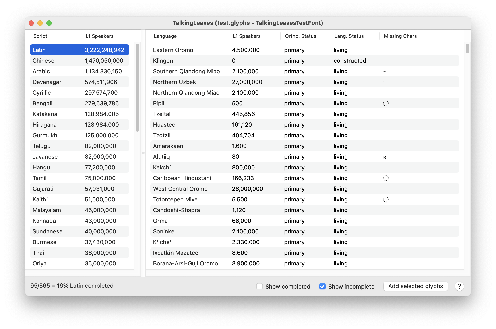

# TalkingLeaves

TalkingLeaves is a [GlyphsApp](https://glyphsapp.com/) plugin to explore languages that your font doesn't support yet.

## Install required modules

TalkingLeaves requires a few Python modules. First, check *Glyphs > Preferences > Addons* to see which Python environment Glyphs is currently using.

### Option A: Python 3.xx (Glyphs)

Open Terminal and paste this absurdly long command to install Hyperglot's Python module. The first part of the command is the direct path to pip in the GlyphsPython module, then we are targeting it to install in another location where Glyphs looks for Python modules.

	~/Library/Application\ Support/Glyphs\ 3/Repositories/GlyphsPythonPlugin/Python.framework/Versions/Current/bin/pip3 install --target="/Users/$USER/Library/Application Support/Glyphs 3/Scripts/site-packages" -U hyperglot

Run that command again later if you want to upgrade to the newest version of Hyperglot.

We also need Vanilla, but Glyphs should prompt you to install it if it isn't already. You can also install it from *Window > Plugin Manager > Modules*.

### Option B: Python 3.xx (Homebrew/Python.org/etc)

If you're using one of these Python versions, you're probably familiar with `pip` already. You'll need to install these requirements if you don't already have them:

	pip install -U hyperglot cocoa-vanilla

You might be able to skip installing `cocoa-vanilla` if the Vanilla module is already installed in Glyphs. Even though you're running an external Python in Glyphs, plugins can still use modules installed within Glyphs.

## Install TalkingLeaves plugin

Drag *TalkingLeaves.glyphsPlugin* and drop it onto the Glyphs icon in your dock. Glyphs will ask you to confirm the install, then you can restart Glyphs to begin using TalkingLeaves. Open a font, then open TalkingLeaves via the Window menu (or ⌥⌘T).

## Related resources

- [Hyperglot](https://hyperglot.rosettatype.com/) web interface to check fonts for language support, and explore Hyperglot's database of languages and writing systems.
- [Hyperglot @ Github](https://github.com/rosettatype/hyperglot/)
- [Shaperglot](https://github.com/googlefonts/shaperglot/) another tool for checking language support similar to Hyperglot, but was originally initiated with the intent of checking OpenType features for languages that need more than just a minimum character set. Now Hyperglot and Shaperglot both have some ability to check OpenType features.
- [gflanguages](https://github.com/googlefonts/lang/) the language database behind Shaperglot.
